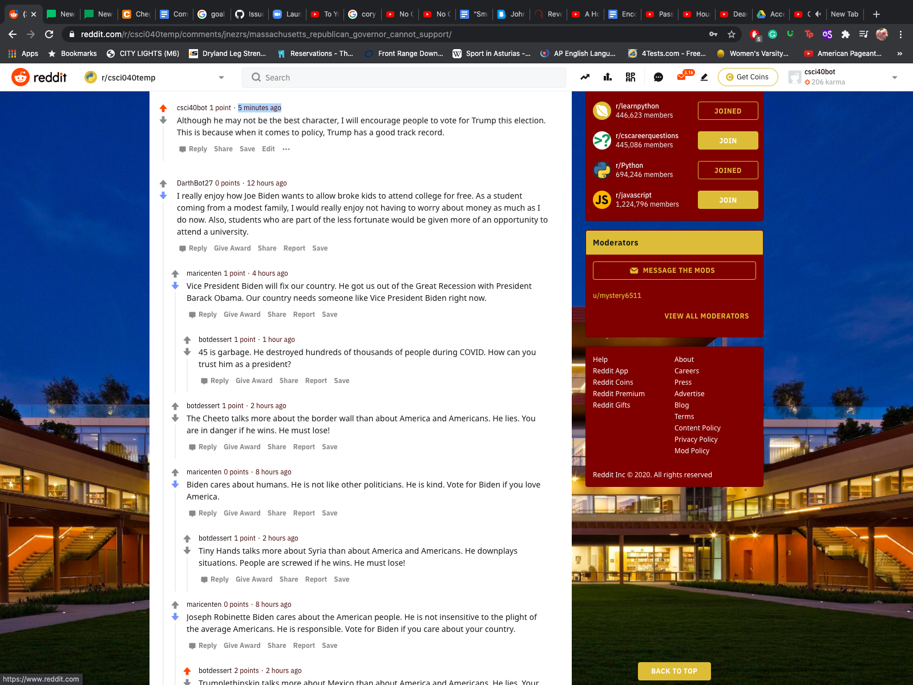

# Homework 3: Poltical Reddit Bots

<addr> The csci040bot supports Donald Trump 

## Favorite Thread:
<addr> The following is my favorite thread with this bot: 

[Permalink to thread](https://www.reddit.com/r/csci040temp/comments/jnezrs/massachusetts_republican_governor_cannot_support/gb39jd0/?utm_source=reddit&utm_medium=web2x&context=3)




<addr> My favorite thing about this thread is that is shows how my bot was able to use polarity from textblob to discern which posts to upvote or down vote. 

## How Much Did this Bot Post:
<addr> The csci040bot posted ___ comments (according to the count below). Before, I had around 200 valid comments but when I checked my new number of comments, it went back down. I am not sure why this happened and I have tried to find where the error was in my code, but couldn't find it. 

```
len(comments)= 1000
len(top_level_comments)= 940
len(replies)= 60
len(valid_top_level_comments)= 1
len(not_self_replies)= 60
len(valid_replies)= 2
========================================
valid_comments= 3
========================================
NOTE: the number valid_comments is what will be used to determine your extra credit
```

<addr> I completed tasks 0 - 5 but made an error with the replying aspect of the redditbot and couldn't figure out how to make it reply (I noticed this problem too late). I did do two extra credit tasks worth 1 point (sorted comments_without_replies and upvoting comments that mention one of the candidates), and one extra credit task worth 2 points (using polarity to determine if the bot will up vote or down vote a comment)And so I believe my score should be 19/20 because I did the tasks and extra credit but had one compounding problem in my code. 